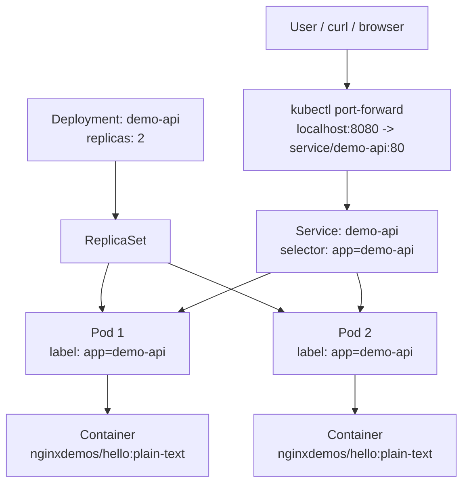

# Session 04 - Kubernetes Core Objects

Vietnamese version: [README.vi.md](README.vi.md)

## Purpose

This session introduces the core Kubernetes objects used to run a containerized application on a cluster.

In previous sessions:

```text
Session 02: Docker builds and runs one container.
Session 03: Docker Compose runs multiple local containers together.
Session 04: Kubernetes manages containers through cluster-level objects.
```

Kubernetes does not replace Docker images. Kubernetes runs containers from images and manages their lifecycle at a higher level.

## What You Will Learn

- What a Kubernetes cluster is.
- How a Namespace separates resources inside a cluster.
- How a Deployment creates and manages Pods.
- How a Service gives Pods a stable internal endpoint.
- How labels and selectors connect Deployments and Services.
- How to access a ClusterIP Service locally with `kubectl port-forward`.
- How Kubernetes self-healing works when a Pod is deleted.
- How readiness and liveness probes differ.
- How CPU and memory requests/limits protect cluster capacity.
- How to load a local Docker image into kind.
- How to inspect and roll back a Deployment rollout.

## Big Picture

```text
Kubernetes Cluster
├── Control Plane
│   └── receives kubectl commands and manages desired state
└── Worker Node(s)
    └── run Pods
```

This lab creates resources inside one namespace:

```text
Cluster
└── namespace: devops-demo
    ├── Deployment: demo-api
    │   ├── ReplicaSet
    │   ├── Pod 1: container from nginxdemos/hello:plain-text
    │   └── Pod 2: container from nginxdemos/hello:plain-text
    └── Service: demo-api
        └── routes traffic to Pods with label app=demo-api
```

Request flow during local testing:

```text
localhost:8080
-> kubectl port-forward
-> Service demo-api:80
-> one matching Pod
-> container port 80
```

GitHub also renders this Mermaid diagram:



## Core Objects

| Object | Simple Meaning | In This Session |
| --- | --- | --- |
| Cluster | The full Kubernetes environment | A local kind cluster |
| Node | A machine/container that runs workloads | A kind node running in Docker |
| Namespace | A logical area inside a cluster | `devops-demo` |
| Pod | The place where containers actually run | Two Pods created by the Deployment |
| Deployment | Desired state for running app replicas | `demo-api` with `replicas: 2` |
| ReplicaSet | Internal object that keeps the requested number of Pods | Created by the Deployment |
| Service | Stable network endpoint for Pods | `demo-api` ClusterIP Service |
| Ingress | HTTP/domain routing into Services | Example only in this session |

## Files

```text
namespace.yaml
deployment.yaml
deployment-local-image.yaml
service.yaml
ingress-example.yaml
```

### namespace.yaml

```yaml
apiVersion: v1
kind: Namespace
metadata:
  name: devops-demo
```

This creates a separate area named `devops-demo` inside the cluster.

### deployment.yaml

```yaml
apiVersion: apps/v1
kind: Deployment
metadata:
  name: demo-api
  namespace: devops-demo
spec:
  replicas: 2
```

This tells Kubernetes:

```text
Keep 2 running Pods for the demo-api application.
```

The container image is:

```yaml
image: nginxdemos/hello:plain-text
```

The Pods created by this Deployment have this label:

```yaml
labels:
  app: demo-api
```

### service.yaml

```yaml
apiVersion: v1
kind: Service
metadata:
  name: demo-api
  namespace: devops-demo
spec:
  type: ClusterIP
  selector:
    app: demo-api
```

This creates an internal Service that selects Pods with:

```text
app=demo-api
```

The selector must match the Pod labels from the Deployment. If the selector does not match, the Service exists but has no Pods to route traffic to.

### deployment-local-image.yaml

This manifest keeps the same Deployment and labels, but changes the container image to the image built in Session 02:

```yaml
image: devops-demo-api:session-02
imagePullPolicy: IfNotPresent
```

kind nodes are separate Docker containers. An image in the WSL Docker Engine is therefore not automatically present inside the kind node. The lab loads it explicitly with `kind load docker-image`.

Both Deployment manifests also include:

```text
readinessProbe = decide whether a Pod can receive Service traffic
livenessProbe  = decide whether Kubernetes should restart the container
resources      = reserve and limit CPU/memory
```

### ingress-example.yaml

This file shows how HTTP/domain routing can point to the Service:

```text
demo.local -> service demo-api -> Pods
```

Do not apply this file yet unless your cluster has an Ingress Controller installed, such as nginx-ingress, Traefik, or AWS Load Balancer Controller.

## Prerequisites

You need a local Kubernetes cluster and `kubectl`.

There are two common local setups:

| Setup | Best For | What To Do |
| --- | --- | --- |
| WSL Ubuntu + Docker Engine | This repository author's setup | Install `kubectl`, install `kind`, create a kind cluster |
| Docker Desktop | Users who prefer the Docker Desktop UI | Enable Kubernetes in Docker Desktop, use the `docker-desktop` kubectl context |

After a cluster is running, the Kubernetes lab commands are the same:

```bash
kubectl apply -f namespace.yaml
kubectl apply -f deployment.yaml
kubectl apply -f service.yaml
kubectl get all -n devops-demo
kubectl port-forward -n devops-demo service/demo-api 8080:80
```

Only the cluster setup step differs.

## Option A - WSL Ubuntu + Docker Engine + kind

Use this path if you are working in WSL and do not use Docker Desktop.

Check Docker:

```bash
docker version
```

You also need:

```text
kubectl = CLI for talking to Kubernetes
kind    = local Kubernetes cluster running in Docker
```

### Step A1 - Install kubectl

Install the latest stable `kubectl` binary for Linux x86-64:

```bash
curl -LO "https://dl.k8s.io/release/$(curl -L -s https://dl.k8s.io/release/stable.txt)/bin/linux/amd64/kubectl"
sudo install -o root -g root -m 0755 kubectl /usr/local/bin/kubectl
rm kubectl
kubectl version --client
```

`kubectl` is the command you use to:

```text
apply YAML files
inspect resources
view logs
port-forward local traffic
delete resources
```

### Step A2 - Install kind

Install `kind` for Linux x86-64:

```bash
curl -Lo ./kind https://kind.sigs.k8s.io/dl/v0.32.0/kind-linux-amd64
chmod +x ./kind
sudo mv ./kind /usr/local/bin/kind
kind version
```

`kind` means Kubernetes in Docker. It creates a local Kubernetes cluster where each node is a Docker container.

### Step A3 - Create A Local Cluster

```bash
kind create cluster --name devops-lab
```

Check the cluster:

```bash
kubectl cluster-info
kubectl get nodes
```

Expected idea:

```text
The cluster exists.
At least one node is Ready.
kubectl can talk to the cluster.
```

## Option B - Docker Desktop Kubernetes

Use this path if you use Docker Desktop instead of WSL Docker Engine.

In Docker Desktop:

```text
Settings
-> Kubernetes
-> Enable Kubernetes
-> Apply & Restart
```

After Kubernetes starts, check your kubectl context:

```bash
kubectl config get-contexts
kubectl config use-context docker-desktop
kubectl get nodes
```

If `kubectl get nodes` shows a Ready node, you can skip the `kind` steps and continue with the lab below.

If `kubectl` is not available in your terminal, install it for your OS or use a terminal where Docker Desktop has configured `kubectl`.

## Step 1 - Apply The Namespace

```bash
cd /mnt/d/DevOps/Ops/session-04-kubernetes-core-objects
kubectl apply -f namespace.yaml
kubectl get namespaces
```

You should see:

```text
devops-demo
```

If you are not using WSL, replace the `cd /mnt/d/...` path with your local clone path.

## Step 2 - Apply The Deployment

```bash
kubectl apply -f deployment.yaml
```

Inspect the Deployment:

```bash
kubectl get deployments -n devops-demo
kubectl describe deployment demo-api -n devops-demo
```

Inspect the Pods:

```bash
kubectl get pods -n devops-demo
```

You should see two Pods because `deployment.yaml` has:

```yaml
replicas: 2
```

## Step 3 - Apply The Service

```bash
kubectl apply -f service.yaml
```

Inspect the Service:

```bash
kubectl get services -n devops-demo
kubectl describe service demo-api -n devops-demo
```

Inspect the endpoints selected by the Service:

```bash
kubectl get endpoints -n devops-demo
```

If the Service selector matches the Pod labels, the Service should have endpoints.

## Step 4 - View Everything In The Namespace

```bash
kubectl get all -n devops-demo
```

You should see objects like:

```text
pod/...
service/demo-api
deployment.apps/demo-api
replicaset.apps/...
```

## Step 5 - Access The App With Port Forward

The Service is `ClusterIP`, so it is internal to the cluster.

Forward your local port `8080` to the Service port `80`:

```bash
kubectl port-forward -n devops-demo service/demo-api 8080:80
```

Keep this terminal open.

Open another WSL terminal:

```bash
curl http://localhost:8080
```

The request path is:

```text
localhost:8080
-> kubectl port-forward
-> service/demo-api:80
-> Pod selected by app=demo-api
-> container port 80
```

## Step 6 - Test Self-Healing

List Pods:

```bash
kubectl get pods -n devops-demo
```

Delete one Pod:

```bash
kubectl delete pod <pod-name> -n devops-demo
```

Watch Kubernetes create a replacement:

```bash
kubectl get pods -n devops-demo -w
```

Why this happens:

```text
Deployment says replicas: 2.
If one Pod disappears, Kubernetes creates another Pod to return to 2.
```

Press `Ctrl+C` to stop watching.

## Step 7 - Test Scaling

Scale to 3 Pods:

```bash
kubectl scale deployment demo-api --replicas=3 -n devops-demo
kubectl get pods -n devops-demo
```

Scale back to 2 Pods:

```bash
kubectl scale deployment demo-api --replicas=2 -n devops-demo
kubectl get pods -n devops-demo
```

This is desired state in action:

```text
You declare the number of replicas.
Kubernetes moves the system toward that number.
```

## Step 8 - Deploy The Session 02 Image To kind

Build the image from Session 02:

```bash
cd /mnt/d/DevOps/Ops/session-02-containerization-basics
docker build -t devops-demo-api:session-02 .
```

Load it into the named kind cluster:

```bash
kind load docker-image devops-demo-api:session-02 --name devops-lab
```

Apply the second Deployment manifest:

```bash
cd /mnt/d/DevOps/Ops/session-04-kubernetes-core-objects
kubectl apply -f deployment-local-image.yaml
kubectl rollout status deployment/demo-api -n devops-demo
```

Keep the existing port-forward running and test again:

```bash
curl http://localhost:8080
```

The response now comes from the FastAPI image built in Session 02:

```text
source code -> Docker image -> kind node -> Deployment -> Pod -> Service
```

If the Pod shows `ImagePullBackOff`, load the image again and inspect the Pod:

```bash
kind load docker-image devops-demo-api:session-02 --name devops-lab
kubectl describe pod -n devops-demo
```

## Step 9 - Inspect And Roll Back A Rollout

```bash
kubectl rollout history deployment/demo-api -n devops-demo
kubectl rollout undo deployment/demo-api -n devops-demo
kubectl rollout status deployment/demo-api -n devops-demo
curl http://localhost:8080
```

The rollback returns to the previous public image. Apply the local image again when you want to continue:

```bash
kubectl apply -f deployment-local-image.yaml
kubectl rollout status deployment/demo-api -n devops-demo
```

## Step 10 - Inspect Probes And Resource Rules

```bash
kubectl describe deployment demo-api -n devops-demo
kubectl get pods -n devops-demo
```

Read the `Requests`, `Limits`, `Liveness`, `Readiness`, and `Conditions` sections:

```text
readiness fails -> Pod stays running but receives no Service traffic
liveness fails  -> kubelet restarts the container
requests        -> scheduler reserves capacity
limits          -> container cannot exceed the configured boundary
```

## Step 11 - Cleanup

Delete all lab resources:

```bash
kubectl delete namespace devops-demo
```

Delete the local kind cluster if you no longer need it:

```bash
kind delete cluster --name devops-lab
```

If you are using Docker Desktop Kubernetes, do not run `kind delete cluster` unless you created a kind cluster. Docker Desktop cluster cleanup is managed from Docker Desktop settings.

## Troubleshooting

### kubectl cannot connect to the cluster

Check:

```bash
kubectl config current-context
kubectl get nodes
kind get clusters
```

If the cluster does not exist:

```bash
kind create cluster --name devops-lab
```

### Pods stay Pending

Check:

```bash
kubectl describe pods -n devops-demo
```

Common reasons:

```text
cluster node is not Ready
image pull problem
not enough local resources
```

### Service does not route traffic

Check labels and selector:

```bash
kubectl get pods -n devops-demo --show-labels
kubectl describe service demo-api -n devops-demo
kubectl get endpoints -n devops-demo
```

The Service selector must match the Pod label:

```text
Service selector: app=demo-api
Pod label:        app=demo-api
```

## Takeaway

Kubernetes answers this question:

```text
How do we run and operate containers reliably on a cluster?
```

The most important relationships:

```text
Deployment creates and manages Pods.
Service routes traffic to Pods using labels and selectors.
Namespace groups related resources inside a cluster.
```

References:

- [Install kubectl on Linux](https://kubernetes.io/docs/tasks/tools/install-kubectl-linux/)
- [kind Quick Start](https://kind.sigs.k8s.io/docs/user/quick-start/)
- [kubectl reference](https://kubernetes.io/docs/reference/kubectl/)
