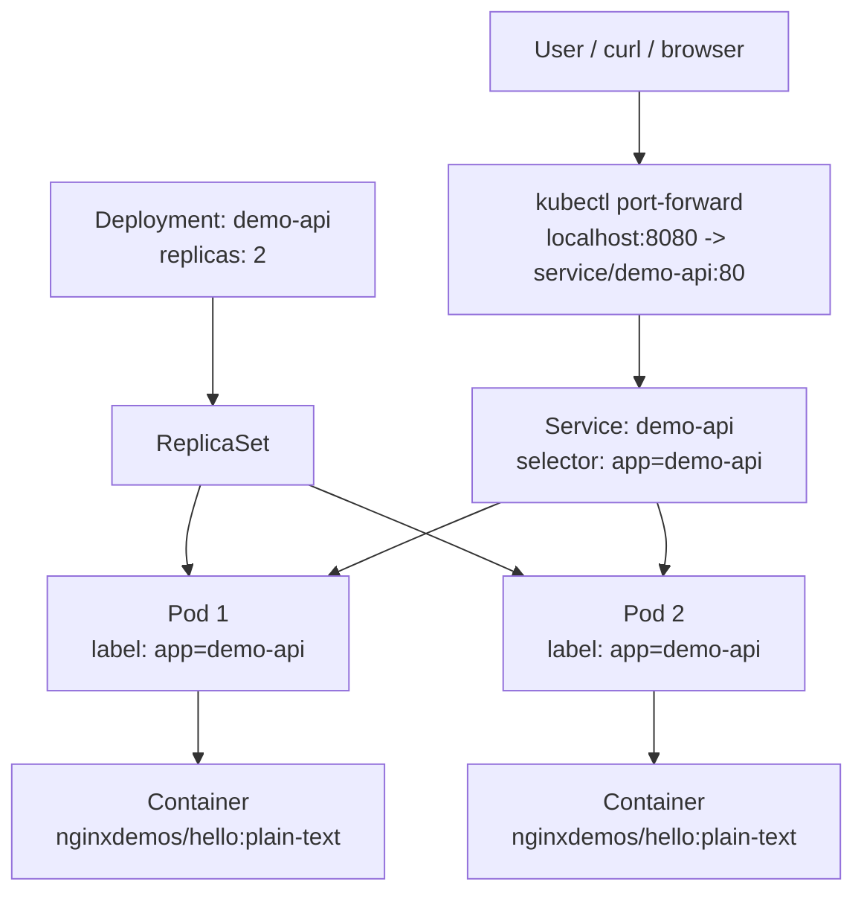

# Session 04 - Kubernetes Core Objects

English version: [README.md](README.md)

## Mục Tiêu

Session này giới thiệu các object Kubernetes cốt lõi dùng để chạy một ứng dụng containerized trên cluster.

Ở các session trước:

```text
Session 02: Docker build và chạy một container.
Session 03: Docker Compose chạy nhiều container local cùng nhau.
Session 04: Kubernetes quản lý container bằng các object ở cấp cluster.
```

Kubernetes không thay thế Docker image. Kubernetes chạy container từ image và quản lý vòng đời của container ở cấp cao hơn.

## Bạn Sẽ Học Gì

- Kubernetes cluster là gì.
- Namespace tách tài nguyên bên trong cluster như thế nào.
- Deployment tạo và quản lý Pod như thế nào.
- Service tạo endpoint ổn định cho Pod như thế nào.
- Labels và selectors nối Deployment với Service ra sao.
- Cách truy cập ClusterIP Service ở local bằng `kubectl port-forward`.
- Self-healing hoạt động thế nào khi một Pod bị xóa.
- Readiness probe và liveness probe khác nhau thế nào.
- CPU/RAM requests và limits bảo vệ tài nguyên cluster ra sao.
- Cách load local Docker image vào kind.
- Cách xem và rollback một Deployment rollout.

## Bức Tranh Tổng Quan

```text
Kubernetes Cluster
├── Control Plane
│   └── nhận lệnh kubectl và quản lý desired state
└── Worker Node(s)
    └── chạy Pods
```

Lab này tạo resource trong một namespace:

```text
Cluster
└── namespace: devops-demo
    ├── Deployment: demo-api
    │   ├── ReplicaSet
    │   ├── Pod 1: container từ nginxdemos/hello:plain-text
    │   └── Pod 2: container từ nginxdemos/hello:plain-text
    └── Service: demo-api
        └── route traffic tới Pods có label app=demo-api
```

Luồng request khi test local:

```text
localhost:8080
-> kubectl port-forward
-> Service demo-api:80
-> một Pod phù hợp
-> container port 80
```

GitHub cũng render được Mermaid diagram này:



## Các Object Cốt Lõi

| Object | Hiểu Đơn Giản | Trong Session Này |
| --- | --- | --- |
| Cluster | Toàn bộ môi trường Kubernetes | Local kind cluster |
| Node | Máy/container chạy workload | kind node chạy bằng Docker |
| Namespace | Khu vực logic trong cluster | `devops-demo` |
| Pod | Nơi container thật sự chạy | Hai Pod do Deployment tạo |
| Deployment | Desired state cho app replicas | `demo-api` với `replicas: 2` |
| ReplicaSet | Object nội bộ giữ đúng số lượng Pod | Được tạo bởi Deployment |
| Service | Endpoint ổn định cho Pod | `demo-api` ClusterIP Service |
| Ingress | HTTP/domain routing vào Service | Chỉ là ví dụ trong session này |

## Các File

```text
namespace.yaml
deployment.yaml
deployment-local-image.yaml
service.yaml
ingress-example.yaml
```

### namespace.yaml

```yaml
apiVersion: v1
kind: Namespace
metadata:
  name: devops-demo
```

File này tạo một khu vực riêng tên `devops-demo` bên trong cluster.

### deployment.yaml

```yaml
apiVersion: apps/v1
kind: Deployment
metadata:
  name: demo-api
  namespace: devops-demo
spec:
  replicas: 2
```

Nó nói với Kubernetes:

```text
Luôn giữ 2 Pod đang chạy cho app demo-api.
```

Container image là:

```yaml
image: nginxdemos/hello:plain-text
```

Các Pod do Deployment tạo sẽ có label:

```yaml
labels:
  app: demo-api
```

### service.yaml

```yaml
apiVersion: v1
kind: Service
metadata:
  name: demo-api
  namespace: devops-demo
spec:
  type: ClusterIP
  selector:
    app: demo-api
```

File này tạo một Service nội bộ, chọn các Pod có:

```text
app=demo-api
```

Selector phải khớp với label của Pod trong Deployment. Nếu selector không khớp, Service vẫn tồn tại nhưng không có Pod nào để route traffic.

### deployment-local-image.yaml

Manifest này vẫn dùng cùng Deployment và labels, nhưng đổi container image sang image đã build ở Session 02:

```yaml
image: devops-demo-api:session-02
imagePullPolicy: IfNotPresent
```

Node của kind là Docker container riêng. Vì vậy image đang có trong Docker Engine của WSL chưa tự động xuất hiện bên trong kind node. Bài lab sẽ load image bằng `kind load docker-image`.

Cả hai Deployment manifest còn có:

```text
readinessProbe = quyết định Pod đã được nhận traffic từ Service chưa
livenessProbe  = quyết định Kubernetes có cần restart container không
resources      = đặt mức CPU/RAM được giữ chỗ và giới hạn
```

### ingress-example.yaml

File này minh họa cách HTTP/domain routing trỏ vào Service:

```text
demo.local -> service demo-api -> Pods
```

Chưa apply file này nếu cluster chưa có Ingress Controller như nginx-ingress, Traefik, hoặc AWS Load Balancer Controller.

## Điều Kiện Cần Có

Bạn cần một local Kubernetes cluster và `kubectl`.

Có hai setup local phổ biến:

| Setup | Phù Hợp Cho | Cần Làm |
| --- | --- | --- |
| WSL Ubuntu + Docker Engine | Setup của repo này | Cài `kubectl`, cài `kind`, tạo kind cluster |
| Docker Desktop | Người muốn dùng UI của Docker Desktop | Bật Kubernetes trong Docker Desktop, dùng kubectl context `docker-desktop` |

Sau khi cluster đã chạy, các lệnh lab Kubernetes là giống nhau:

```bash
kubectl apply -f namespace.yaml
kubectl apply -f deployment.yaml
kubectl apply -f service.yaml
kubectl get all -n devops-demo
kubectl port-forward -n devops-demo service/demo-api 8080:80
```

Chỉ phần tạo cluster ban đầu là khác.

## Option A - WSL Ubuntu + Docker Engine + kind

Dùng hướng này nếu bạn làm việc trong WSL và không dùng Docker Desktop.

Kiểm tra Docker:

```bash
docker version
```

Bạn cần thêm:

```text
kubectl = CLI để nói chuyện với Kubernetes
kind    = local Kubernetes cluster chạy bằng Docker
```

### Bước A1 - Cài kubectl

Cài bản `kubectl` stable mới nhất cho Linux x86-64:

```bash
curl -LO "https://dl.k8s.io/release/$(curl -L -s https://dl.k8s.io/release/stable.txt)/bin/linux/amd64/kubectl"
sudo install -o root -g root -m 0755 kubectl /usr/local/bin/kubectl
rm kubectl
kubectl version --client
```

`kubectl` là lệnh dùng để:

```text
apply file YAML
xem resource
xem log
port-forward traffic local
xóa resource
```

### Bước A2 - Cài kind

Cài `kind` cho Linux x86-64:

```bash
curl -Lo ./kind https://kind.sigs.k8s.io/dl/v0.32.0/kind-linux-amd64
chmod +x ./kind
sudo mv ./kind /usr/local/bin/kind
kind version
```

`kind` nghĩa là Kubernetes in Docker. Nó tạo local Kubernetes cluster, trong đó mỗi node là một Docker container.

### Bước A3 - Tạo Local Cluster

```bash
kind create cluster --name devops-lab
```

Kiểm tra cluster:

```bash
kubectl cluster-info
kubectl get nodes
```

Kết quả mong đợi:

```text
Cluster đã tồn tại.
Ít nhất một node ở trạng thái Ready.
kubectl nói chuyện được với cluster.
```

## Option B - Docker Desktop Kubernetes

Dùng hướng này nếu bạn dùng Docker Desktop thay vì WSL Docker Engine.

Trong Docker Desktop:

```text
Settings
-> Kubernetes
-> Enable Kubernetes
-> Apply & Restart
```

Sau khi Kubernetes start, kiểm tra kubectl context:

```bash
kubectl config get-contexts
kubectl config use-context docker-desktop
kubectl get nodes
```

Nếu `kubectl get nodes` hiển thị một node Ready, bạn có thể bỏ qua các bước `kind` và đi tiếp phần lab bên dưới.

Nếu terminal của bạn chưa có `kubectl`, hãy cài `kubectl` cho đúng OS hoặc dùng terminal đã được Docker Desktop cấu hình `kubectl`.

## Bước 1 - Apply Namespace

```bash
cd /mnt/d/DevOps/Ops/session-04-kubernetes-core-objects
kubectl apply -f namespace.yaml
kubectl get namespaces
```

Bạn sẽ thấy:

```text
devops-demo
```

Nếu không dùng WSL, thay path `cd /mnt/d/...` bằng path nơi bạn clone repo.

## Bước 2 - Apply Deployment

```bash
kubectl apply -f deployment.yaml
```

Kiểm tra Deployment:

```bash
kubectl get deployments -n devops-demo
kubectl describe deployment demo-api -n devops-demo
```

Kiểm tra Pod:

```bash
kubectl get pods -n devops-demo
```

Bạn sẽ thấy hai Pod vì `deployment.yaml` có:

```yaml
replicas: 2
```

## Bước 3 - Apply Service

```bash
kubectl apply -f service.yaml
```

Kiểm tra Service:

```bash
kubectl get services -n devops-demo
kubectl describe service demo-api -n devops-demo
```

Kiểm tra endpoints mà Service chọn được:

```bash
kubectl get endpoints -n devops-demo
```

Nếu Service selector khớp với Pod labels, Service sẽ có endpoints.

## Bước 4 - Xem Toàn Bộ Object Trong Namespace

```bash
kubectl get all -n devops-demo
```

Bạn sẽ thấy các object như:

```text
pod/...
service/demo-api
deployment.apps/demo-api
replicaset.apps/...
```

## Bước 5 - Truy Cập App Bằng Port Forward

Service hiện là `ClusterIP`, nghĩa là chỉ dùng nội bộ trong cluster.

Forward cổng local `8080` vào Service port `80`:

```bash
kubectl port-forward -n devops-demo service/demo-api 8080:80
```

Giữ terminal này mở.

Mở một WSL terminal khác:

```bash
curl http://localhost:8080
```

Luồng request:

```text
localhost:8080
-> kubectl port-forward
-> service/demo-api:80
-> Pod được chọn bởi app=demo-api
-> container port 80
```

## Bước 6 - Test Self-Healing

Liệt kê Pod:

```bash
kubectl get pods -n devops-demo
```

Xóa một Pod:

```bash
kubectl delete pod <pod-name> -n devops-demo
```

Quan sát Kubernetes tạo Pod thay thế:

```bash
kubectl get pods -n devops-demo -w
```

Lý do:

```text
Deployment nói replicas: 2.
Nếu mất một Pod, Kubernetes tạo Pod khác để quay lại đủ 2.
```

Bấm `Ctrl+C` để dừng watch.

## Bước 7 - Test Scaling

Scale lên 3 Pod:

```bash
kubectl scale deployment demo-api --replicas=3 -n devops-demo
kubectl get pods -n devops-demo
```

Scale về 2 Pod:

```bash
kubectl scale deployment demo-api --replicas=2 -n devops-demo
kubectl get pods -n devops-demo
```

Đây là desired state:

```text
Bạn khai báo số replica mong muốn.
Kubernetes đưa hệ thống về đúng số đó.
```

## Bước 8 - Deploy Image Của Session 02 Lên kind

Build image ở Session 02:

```bash
cd /mnt/d/DevOps/Ops/session-02-containerization-basics
docker build -t devops-demo-api:session-02 .
```

Load image vào đúng kind cluster:

```bash
kind load docker-image devops-demo-api:session-02 --name devops-lab
```

Apply Deployment manifest thứ hai:

```bash
cd /mnt/d/DevOps/Ops/session-04-kubernetes-core-objects
kubectl apply -f deployment-local-image.yaml
kubectl rollout status deployment/demo-api -n devops-demo
```

Giữ lệnh port-forward đang chạy rồi gọi lại API:

```bash
curl http://localhost:8080
```

Kết quả bây giờ đến từ FastAPI image của Session 02:

```text
source code -> Docker image -> kind node -> Deployment -> Pod -> Service
```

Nếu Pod bị `ImagePullBackOff`, load lại image và kiểm tra Pod:

```bash
kind load docker-image devops-demo-api:session-02 --name devops-lab
kubectl describe pod -n devops-demo
```

## Bước 9 - Xem Và Rollback Một Rollout

```bash
kubectl rollout history deployment/demo-api -n devops-demo
kubectl rollout undo deployment/demo-api -n devops-demo
kubectl rollout status deployment/demo-api -n devops-demo
curl http://localhost:8080
```

Rollback đưa app về public image trước đó. Khi muốn tiếp tục với local image, apply lại:

```bash
kubectl apply -f deployment-local-image.yaml
kubectl rollout status deployment/demo-api -n devops-demo
```

## Bước 10 - Kiểm Tra Probes Và Resource Rules

```bash
kubectl describe deployment demo-api -n devops-demo
kubectl get pods -n devops-demo
```

Đọc các phần `Requests`, `Limits`, `Liveness`, `Readiness` và `Conditions`:

```text
readiness fail -> Pod vẫn chạy nhưng không nhận traffic từ Service
liveness fail  -> kubelet restart container
requests       -> scheduler giữ chỗ tài nguyên
limits         -> container không được vượt quá giới hạn đã đặt
```

## Bước 11 - Cleanup

Xóa toàn bộ resource của lab:

```bash
kubectl delete namespace devops-demo
```

Nếu không cần local cluster nữa:

```bash
kind delete cluster --name devops-lab
```

Nếu dùng Docker Desktop Kubernetes, đừng chạy `kind delete cluster` trừ khi bạn đã tự tạo kind cluster. Cluster của Docker Desktop được quản lý trong Docker Desktop settings.

## Troubleshooting

### kubectl không kết nối được cluster

Kiểm tra:

```bash
kubectl config current-context
kubectl get nodes
kind get clusters
```

Nếu cluster chưa tồn tại:

```bash
kind create cluster --name devops-lab
```

### Pod bị Pending

Kiểm tra:

```bash
kubectl describe pods -n devops-demo
```

Nguyên nhân thường gặp:

```text
cluster node chưa Ready
lỗi pull image
máy local thiếu tài nguyên
```

### Service không route traffic

Kiểm tra labels và selector:

```bash
kubectl get pods -n devops-demo --show-labels
kubectl describe service demo-api -n devops-demo
kubectl get endpoints -n devops-demo
```

Service selector phải khớp với Pod label:

```text
Service selector: app=demo-api
Pod label:        app=demo-api
```

## Kết Luận

Kubernetes trả lời câu hỏi:

```text
Làm sao chạy và vận hành container ổn định trên cluster?
```

Các quan hệ quan trọng nhất:

```text
Deployment tạo và quản lý Pod.
Service route traffic tới Pod bằng labels và selectors.
Namespace gom nhóm resource liên quan bên trong cluster.
```

Tham khảo:

- [Install kubectl on Linux](https://kubernetes.io/docs/tasks/tools/install-kubectl-linux/)
- [kind Quick Start](https://kind.sigs.k8s.io/docs/user/quick-start/)
- [kubectl reference](https://kubernetes.io/docs/reference/kubectl/)
