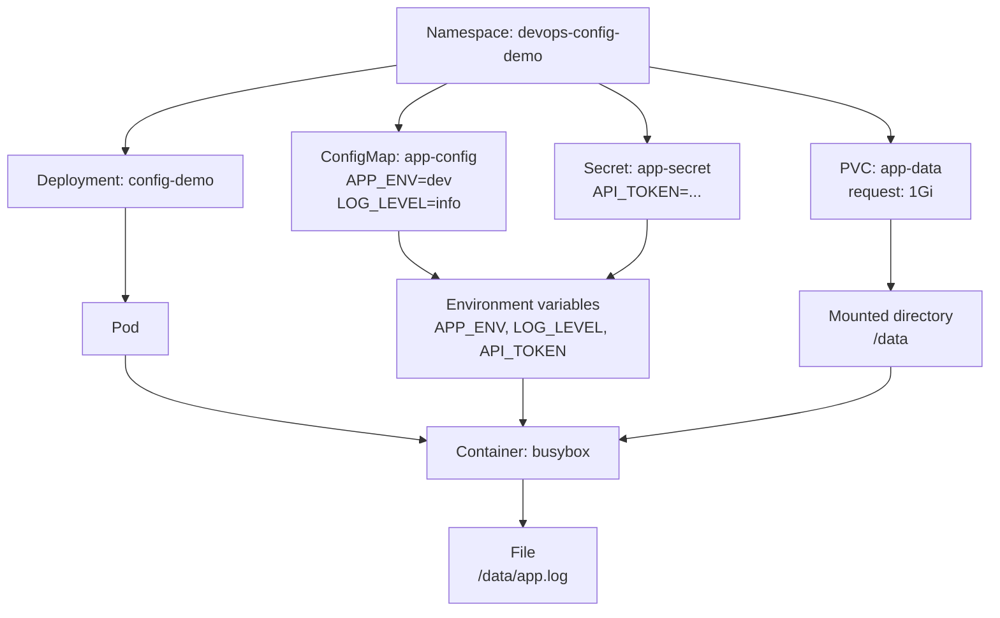

# Session 05 - Kubernetes Config & Storage

English version: [README.md](README.md)

## Mục Tiêu

Session 04 đã chỉ cách chạy ứng dụng trên Kubernetes bằng Deployment và Service.

Session 05 trả lời câu hỏi vận hành tiếp theo:

```text
App đã chạy rồi, vậy config, credential, và data bền vững nên nằm ở đâu?
```

Session này giới thiệu:

```text
ConfigMap = runtime config không nhạy cảm
Secret    = runtime config nhạy cảm
PVC       = yêu cầu storage bền vững từ cluster
Volume    = cách mount storage vào container
```

## Vì Sao Quan Trọng?

Không nên đóng cứng config theo môi trường vào Docker image.

Thay vào đó:

```text
cùng một image
+ ConfigMap/Secret/PVC khác nhau theo từng môi trường
= cùng app có thể chạy ở dev, staging, production
```

Ví dụ:

```text
Docker image chứa: app code và runtime
ConfigMap chứa: APP_ENV, LOG_LEVEL
Secret chứa: API_TOKEN, DATABASE_PASSWORD
PVC chứa: file app, upload, hoặc database data
```

## Sơ Đồ Dễ Hiểu

```text
Namespace: devops-config-demo
├── ConfigMap: app-config
│   ├── APP_ENV=dev
│   └── LOG_LEVEL=info
├── Secret: app-secret
│   └── API_TOKEN=...
├── PVC: app-data
│   └── requests 1Gi storage
└── Deployment: config-demo
    └── Pod
        └── Container: busybox
            ├── env từ ConfigMap
            ├── env từ Secret
            └── /data mount từ PVC
```

Luồng dữ liệu:

```text
ConfigMap/Secret
-> envFrom
-> environment variables trong container

PVC
-> volumes
-> volumeMounts
-> thư mục /data trong container
```

GitHub cũng render được Mermaid diagram này:



## Các Object Cốt Lõi

| Object | Dùng Để | Ví Dụ Trong Session Này |
| --- | --- | --- |
| Namespace | Gom resource trong cluster | `devops-config-demo` |
| ConfigMap | Lưu config không nhạy cảm | `APP_ENV`, `LOG_LEVEL` |
| Secret | Lưu config nhạy cảm | `API_TOKEN` |
| PersistentVolumeClaim | Xin storage bền vững | `app-data`, `1Gi` |
| Volume | Gắn storage vào Pod | `volumes[].persistentVolumeClaim` |
| volumeMount | Mount Volume vào path trong container | `/data` |
| envFrom | Load toàn bộ key từ ConfigMap/Secret thành env vars | `app-config`, `app-secret` |

## Các File

```text
namespace.yaml
configmap.yaml
secret.yaml
pvc.yaml
deployment-with-config-storage.yaml
```

### namespace.yaml

Tạo namespace cho lab:

```yaml
apiVersion: v1
kind: Namespace
metadata:
  name: devops-config-demo
```

### configmap.yaml

Lưu config không nhạy cảm:

```yaml
apiVersion: v1
kind: ConfigMap
metadata:
  name: app-config
  namespace: devops-config-demo
data:
  APP_ENV: "dev"
  LOG_LEVEL: "info"
```

Dùng ConfigMap cho các giá trị như:

```text
APP_ENV
LOG_LEVEL
feature flags
service URLs không nhạy cảm
```

Không để password, token, private key trong ConfigMap.

### secret.yaml

Lưu config nhạy cảm:

```yaml
apiVersion: v1
kind: Secret
metadata:
  name: app-secret
  namespace: devops-config-demo
type: Opaque
stringData:
  API_TOKEN: "replace-me-for-real-projects"
```

Dùng Secret cho các giá trị như:

```text
DATABASE_PASSWORD
API_TOKEN
PRIVATE_KEY
JWT_SECRET
```

Quan trọng: Kubernetes Secret không tự động là giải pháp secret-management hoàn chỉnh cho production. Trong production, nên cân nhắc AWS Secrets Manager, External Secrets Operator, Sealed Secrets, SOPS, và encryption at rest.

### pvc.yaml

Xin storage bền vững từ cluster:

```yaml
apiVersion: v1
kind: PersistentVolumeClaim
metadata:
  name: app-data
  namespace: devops-config-demo
spec:
  accessModes:
    - ReadWriteOnce
  resources:
    requests:
      storage: 1Gi
```

Nghĩa là:

```text
App xin cluster cấp 1Gi storage bền vững.
```

`ReadWriteOnce` nghĩa là volume có thể được mount read/write bởi một node tại một thời điểm.

### deployment-with-config-storage.yaml

Deployment này dùng ConfigMap, Secret, và PVC.

Load toàn bộ key từ ConfigMap và Secret thành environment variables:

```yaml
envFrom:
  - configMapRef:
      name: app-config
  - secretRef:
      name: app-secret
```

Mount PVC vào container:

```yaml
volumeMounts:
  - name: app-data
    mountPath: /data
```

Nối Volume với PVC:

```yaml
volumes:
  - name: app-data
    persistentVolumeClaim:
      claimName: app-data
```

Command của container:

```yaml
args:
  - |
    echo "APP_ENV=$APP_ENV";
    echo "LOG_LEVEL=$LOG_LEVEL";
    echo "data from pod start" >> /data/app.log;
    tail -f /data/app.log
```

Nó in config values, ghi một dòng vào `/data/app.log`, rồi dùng `tail -f` để container tiếp tục chạy.

## Điều Kiện Cần Có

Bạn cần Kubernetes cluster đã chạy từ Session 04.

Kiểm tra:

```bash
kubectl get nodes
```

Nếu chưa có cluster, quay lại Session 04 và tạo local cluster bằng kind hoặc Docker Desktop Kubernetes.

## Bước 1 - Apply Namespace

```bash
cd /mnt/d/DevOps/Ops/session-05-k8s-config-storage
kubectl apply -f namespace.yaml
kubectl get namespaces
```

Nếu không dùng WSL, thay path `cd /mnt/d/...` bằng path nơi bạn clone repo.

## Bước 2 - Apply ConfigMap Và Secret

```bash
kubectl apply -f configmap.yaml
kubectl apply -f secret.yaml
```

Kiểm tra:

```bash
kubectl get configmap,secret -n devops-config-demo
kubectl describe configmap app-config -n devops-config-demo
kubectl describe secret app-secret -n devops-config-demo
```

Không dùng `kubectl describe secret` trong screenshot chia sẻ nếu secret là giá trị thật.

## Bước 3 - Apply PVC

```bash
kubectl apply -f pvc.yaml
```

Kiểm tra claim:

```bash
kubectl get pvc -n devops-config-demo
kubectl describe pvc app-data -n devops-config-demo
```

Kết quả mong đợi:

```text
PVC chuyển sang Bound.
```

Nếu PVC bị Pending, cluster có thể chưa có default StorageClass.

Kiểm tra:

```bash
kubectl get storageclass
```

## Bước 4 - Apply Deployment

```bash
kubectl apply -f deployment-with-config-storage.yaml
```

Kiểm tra Pod:

```bash
kubectl get pods -n devops-config-demo
kubectl get all -n devops-config-demo
```

## Bước 5 - Verify Environment Variables

Xem container logs:

```bash
kubectl logs -n devops-config-demo deploy/config-demo
```

Kết quả mong đợi:

```text
APP_ENV=dev
LOG_LEVEL=info
```

Xem environment variables trong container:

```bash
kubectl exec -n devops-config-demo deploy/config-demo -- env
```

Bạn sẽ thấy:

```text
APP_ENV=dev
LOG_LEVEL=info
API_TOKEN=replace-me-for-real-projects
```

## Bước 6 - Verify Mounted Storage

Đọc file được ghi vào `/data`:

```bash
kubectl exec -n devops-config-demo deploy/config-demo -- cat /data/app.log
```

Bạn sẽ thấy:

```text
data from pod start
```

## Bước 7 - Test Pod Recreation

Liệt kê Pod:

```bash
kubectl get pods -n devops-config-demo
```

Xóa Pod:

```bash
kubectl delete pod <pod-name> -n devops-config-demo
```

Đợi Kubernetes tạo lại Pod:

```bash
kubectl get pods -n devops-config-demo
```

Đọc lại file:

```bash
kubectl exec -n devops-config-demo deploy/config-demo -- cat /data/app.log
```

Hành vi cụ thể có thể khác nhau tùy storage implementation của local cluster, nhưng ý chính là:

```text
Data cần sống qua Pod recreation thì không nên chỉ nằm trong filesystem của container.
Hãy dùng path được mount từ PVC.
```

## Bước 8 - Cleanup

Xóa toàn bộ resource của lab:

```bash
kubectl delete namespace devops-config-demo
```

## Troubleshooting

### Pod bị Pending

Kiểm tra:

```bash
kubectl describe pod -n devops-config-demo
kubectl get pvc -n devops-config-demo
kubectl get storageclass
```

Nguyên nhân thường gặp:

```text
PVC chưa Bound
không có default StorageClass
cluster node chưa Ready
```

### Environment variables bị thiếu

Kiểm tra:

```bash
kubectl get configmap app-config -n devops-config-demo -o yaml
kubectl get secret app-secret -n devops-config-demo -o yaml
kubectl describe deployment config-demo -n devops-config-demo
```

Đảm bảo tên khớp:

```text
configMapRef.name = app-config
secretRef.name    = app-secret
```

### /data bị thiếu hoặc không ghi được

Kiểm tra:

```bash
kubectl describe pod -n devops-config-demo
kubectl describe pvc app-data -n devops-config-demo
```

Đảm bảo tên khớp:

```text
volumeMounts[].name = app-data
volumes[].name      = app-data
persistentVolumeClaim.claimName = app-data
```

## Kết Luận

Ý quan trọng nhất:

```text
Không hardcode runtime config, credential, hoặc persistent data vào image.
```

Dùng:

```text
ConfigMap cho config không nhạy cảm.
Secret cho config nhạy cảm.
PVC và volumeMounts cho data bền vững.
```

Tham khảo:

- [Kubernetes ConfigMaps](https://kubernetes.io/docs/concepts/configuration/configmap/)
- [Kubernetes Secrets](https://kubernetes.io/docs/concepts/configuration/secret/)
- [Kubernetes Persistent Volumes](https://kubernetes.io/docs/concepts/storage/persistent-volumes/)
